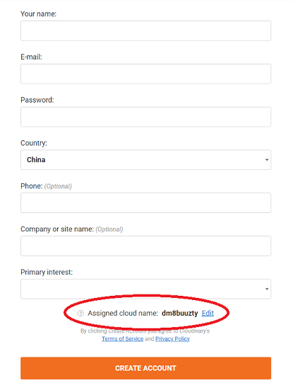
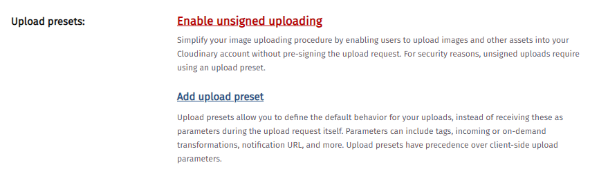
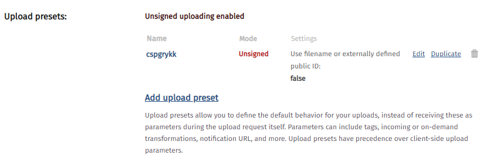
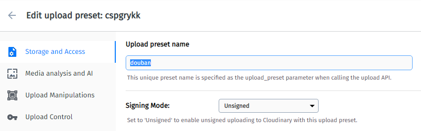
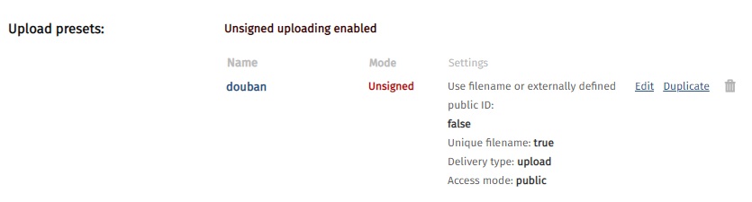
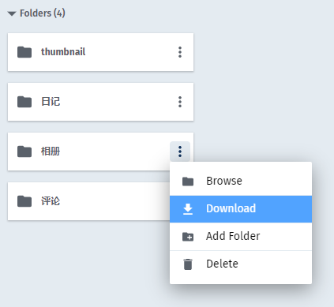

自**豆伴**[v0.5.0](https://download.doufen.org/)起，支持将备份数据中的图片同步上传到[Cloudinary](https://cloudinary.com/)的云存储空间。Cloudinary的免费账号有10G空间，最多可储存30万张图片。

## 第一步，注册Cloudinary

打开注册页面：[https://cloudinary.com/users/register/free](https://cloudinary.com/users/register/free) ；

**注意**下方的`Assigned cloud name`，如果不设置，系统会自动分配一个随机的`cloud name`。为了便于记忆，最好自己手动填写。该名称会在之后设置豆伴时用到。

电话和公司等信息为选填，可以不必填写。注册后会向注册邮箱发送一封激活邮件，请注意查收，并点击邮件中的激活链接。

## 第二步，配置Cloudinary

注册完成并登录后，进入设置页面：[https://cloudinary.com/console/settings/upload](https://cloudinary.com/console/settings/upload) ；

找到`Upload presets`设置，点击`Enable unsigned uploading`；

系统会生成一个名称为随机字符的`Upload preset`。点击右边的`Edit`，进入设置编辑页面；

将`Upload preset name`改为“douban”。点击页面右上角的`Save`按钮。

得到如图配置：

点击页面下方的`Save`按钮，保存并完成设置。

## 第三步，设置豆伴

打开豆伴的`设置`页面，在`常规`选项卡中，将第一步中创建的`Cloud name`填入`图片云存储`一栏的输入框中：

点击`保存`按钮使设置生效。

## 使用方式

在豆伴`新建任务`的页面中，勾选`同步相册、日记、评论以及广播中的图片至 Cloudinary`，然后点击`新建`按钮。

图片上传完成后，可以前往 https://cloudinary.com/console/media_library/folders/all/ 查看。每个账号的图片会保存在独立的文件夹下，并按照相册、日记、评论、笔记和广播等几种类型按文件夹保存。

另外，可以在每个文件夹的操作菜单里，选择`Download`进行下载。

